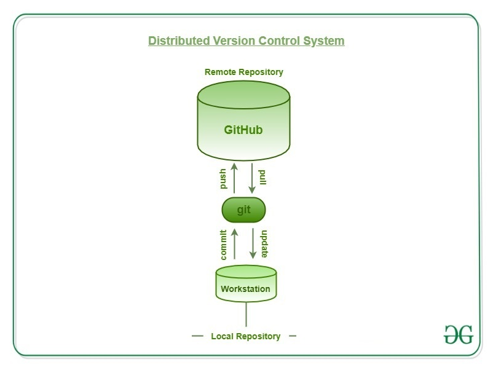
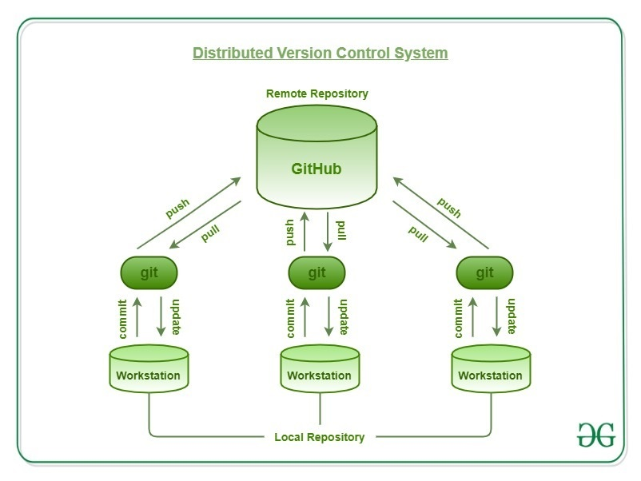

# Git, GitHub, and Jupyter
## Lecture Notes

Ty Janoski
City College of New York, CUNY 

---

## Learning objectives:

- Understand **version control** and its role in collaborative software development.

- Learn to effectively use **Jupyter notebooks** for data analysis and collaborative documentation.

- Develop skills to set up and manage **collaborative workflows** with Git/GitHub and Jupyter for group projects.

---

## An introduction to version control

---

---

# Basics of version control

1) Add file(s) to a staging area.
`git add myfile.py`
2) Write changes to a local repository.
`git commit -m "made some changes"`
3) (Opt.) Push changes to *remote* repository.
`git push -u origin main`

Note: while it's good to know these commands, we will use a GUI to make it easier.

---

---

# Git is helpful on its own:

- It lets you easily track changes to your code
- If something goes wrong, you can rollback to an earlier, working version
- You can organize your tasks and workflow ("branching")

### But it really shines when used with GitHub!

---

# GitHub

---

# GitHub

GitHub is a website where you can host your code & files in databases called "repositories."
  
I don't fully understand how GitHub gets money but they offer tons of services for free. No need to question it!

---

---

## Here's a typical workflow.
1) `git add your-files-here.txt` to add your files and edits to the staging area
2) `git commit -m "your message here"` to put these updated files to your *local* repository
3) `git push` your changes to GitHub repository

Note: Before pushing the first time, we will have to connect our Git and GitHub repositories.

---

## Branching

---

## Branching

In Git/GitHub, branching creates **a parallel version of the code** to work on new features or fixes *without affecting the main codebase*. It allows developers to isolate their work, make changes, and then merge those changes back into the main code when they are ready.

---

### Branching workflow

- Create and switch to branch
- Add commits
- Push branch to GitHub
- Start a **pull request**
- Review & merge

---

## Pull requests

A pull request is a way to propose changes from a branch in a repository to the main code. It allows developers to notify others about the changes they've made, discuss modifications, and eventually merge the changes into the main code.

---

### Pull requests

---

Version control with Git and GitHub can be confusing. You don't need to understand everything right now to develop a collaborative workflow for this class 😁.

---

## Resources/References

- [Learn git branching](https://learngitbranching.js.org/?locale=en_US)
- [Git/GitHub Lecture by Madicken Munk](https://munkm.github.io/2024-winterschool/git-collaboration.slides.html#/)
- [GitHub Docs](https://docs.github.com/en)
- [The Git book](https://git-scm.com/book/en/v2)