# Git, GitHub, and Jupyter
## In-class exercise

Ty Janoski
City College of New York, CUNY 

---

## Let's set up a workflow for your in-class project.

---

### Creating a GitHub repository

Have *one* member of your group create a repository. This person will be the owner. * 
  
 * The owner doesn't have any special responsibilities, so don't worry. 

---

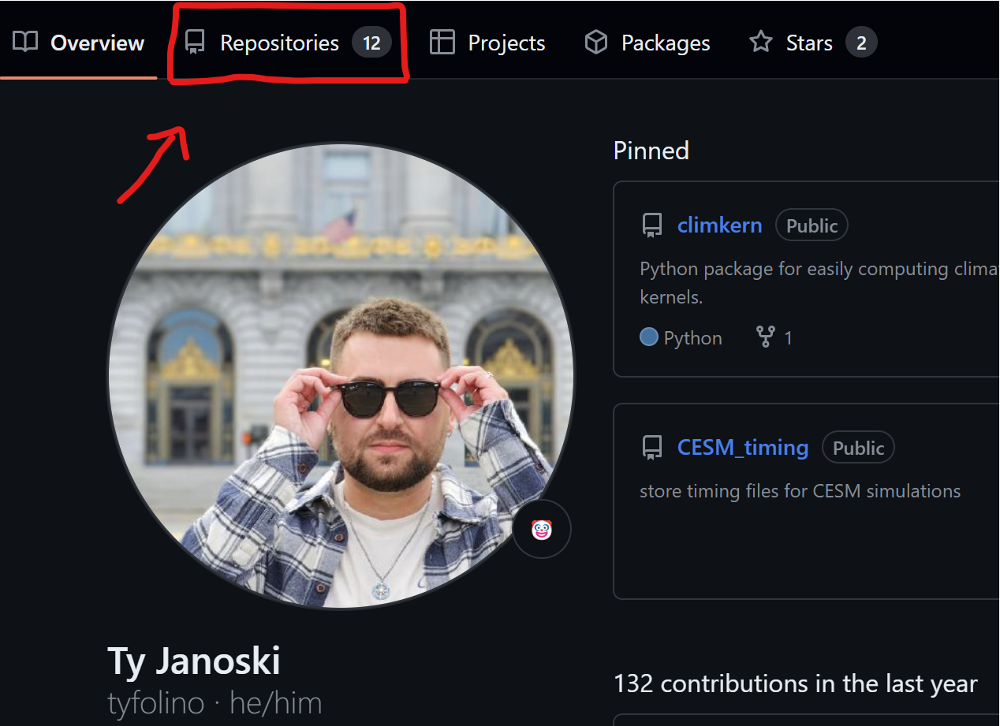

---

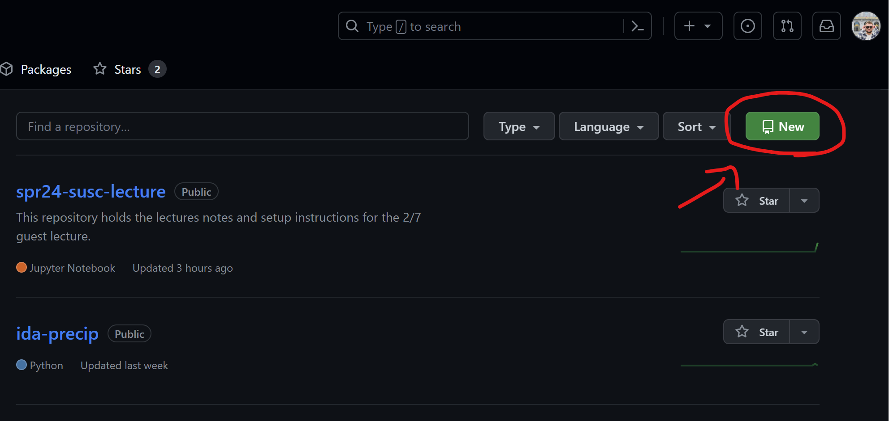

---

- Pick a name for your repository, like `SUSC`.
- Give it a short description.
- Leave it public.
- You can skip the `README`, `.gitignore`, and license for now.

--- 

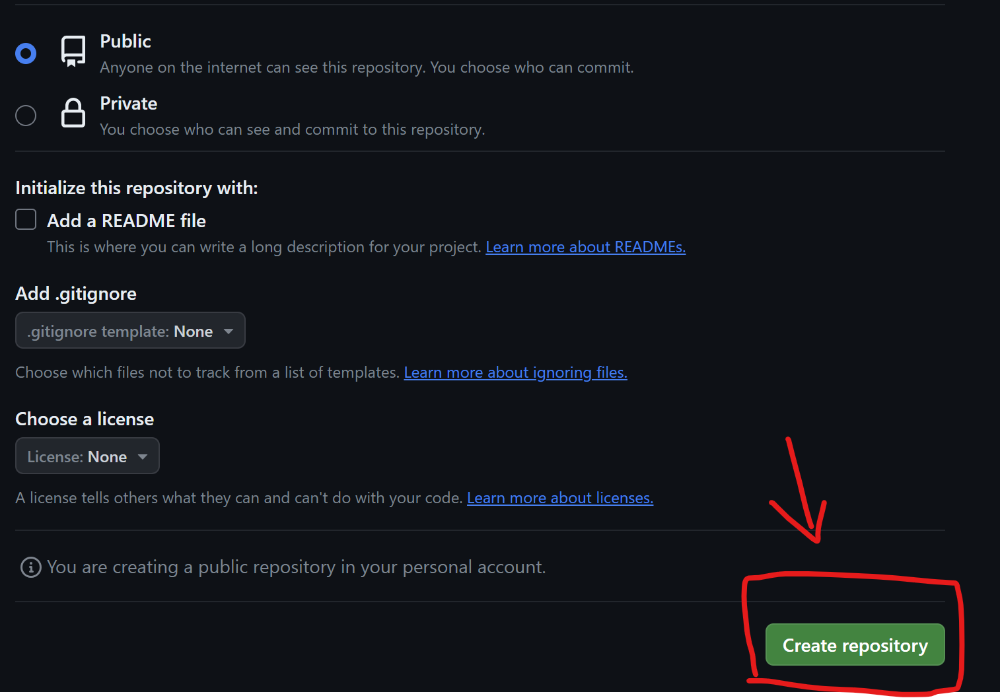

---

### Invite your group members as collaborators

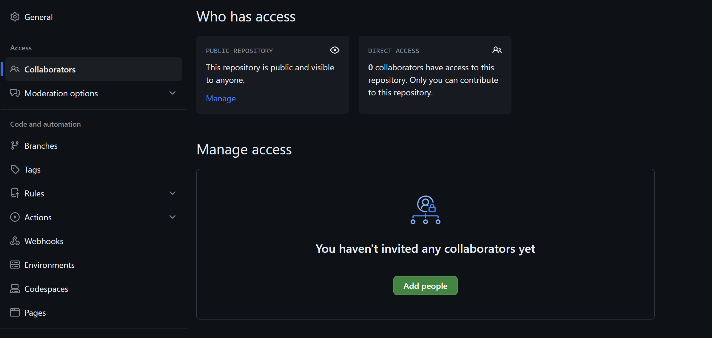

---

Create a new folder on your computer where your Jupyter Notebook for this class will live.

  

Make sure you can navigate to it using JupyterLab!

---

### Initialize a new repository

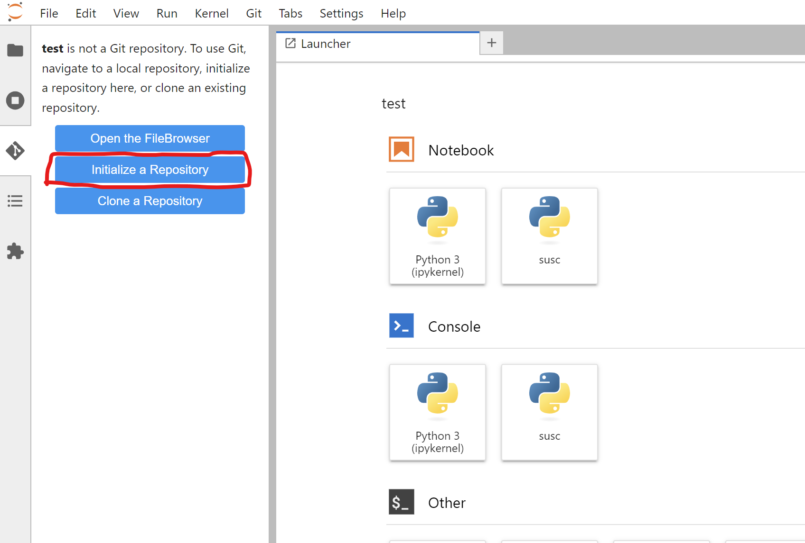

---

### Create a new notebook

- When selecting the kernel, make sure it is `susc`
- In your first cell, run this code:
`!git branch -m main`
`!git config --global user.name "First Last"`
`!git config --global user.email "your-github-email@example.com"`

---

### Add your notebook

Hit the plus sign.

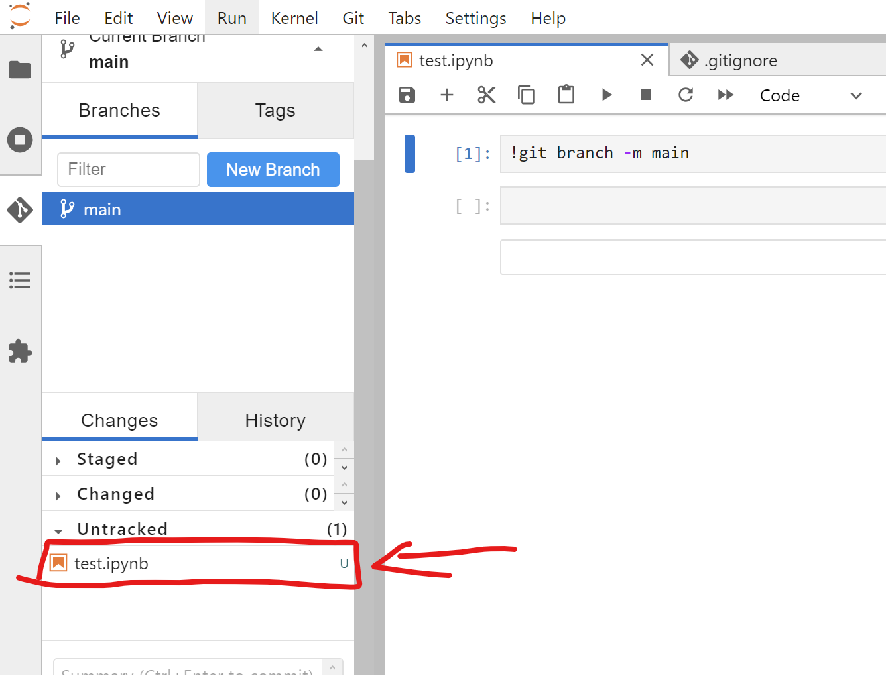

---

### Commit the changes
An example summary is "`added my first file`"

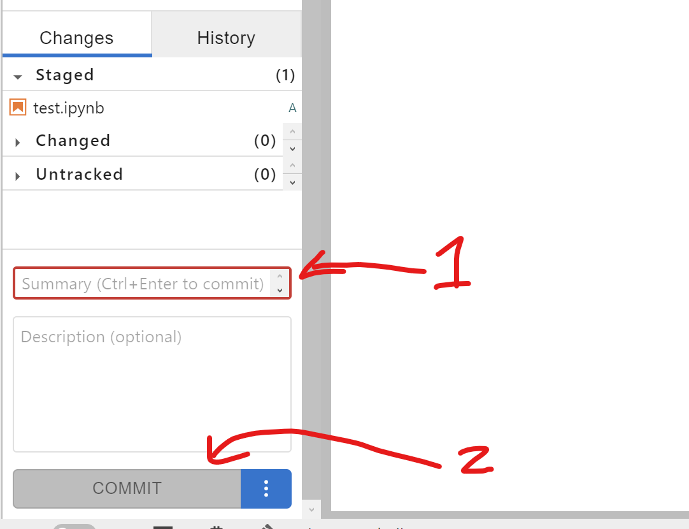

---

### Connect to remote repository

In the top menu bar, git -> manage remote

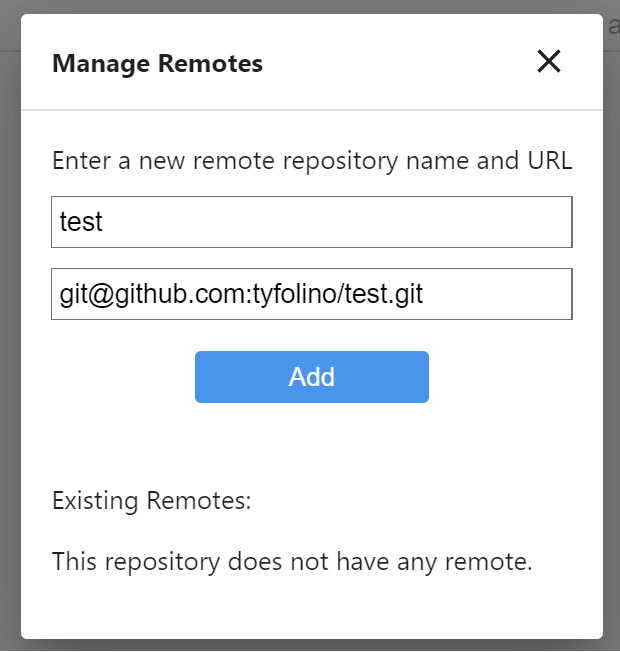

---

### Push to GitHub

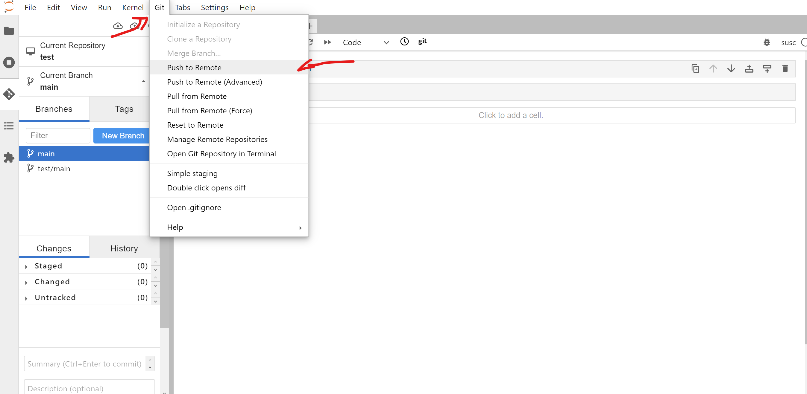

---

# In case people are having authentication issues...

----

### Authentication to remote repository hosts

If you are seeing errors similar to `[E yyyy-mm-dd hh:mm:ss ServerApp] 500 POST /git/<clone|push|pull|status>` on the console which is running the JupyterLab server, you probably need to set up a credentials store for your local Git repository.

This extension tries to handle credentials for HTTP(S) connections (if you don't have set up a credential manager). But not for other SSH connections.

---

### A note for windows users. 

> For Windows users, it is recommended to install [git for windows](https://gitforwindows.org/). It will automatically set up a credential manager.
> In order to connect to a remote host, it is recommended to use SSH.

---

#### SSH protocol

Here are the steps to follow to set up SSH authentication (skip any that is already accomplished for your project):

1. [Create a SSH key](https://docs.github.com/en/github/authenticating-to-github/connecting-to-github-with-ssh/generating-a-new-ssh-key-and-adding-it-to-the-ssh-agent)
2. Register the public part of it to your Git server:
   - [GitHub](https://docs.github.com/en/github/authenticating-to-github/connecting-to-github-with-ssh/adding-a-new-ssh-key-to-your-github-account)

---

3. Tell your local Git repository to [connect to remote via ssh](https://docs.github.com/en/get-started/getting-started-with-git/managing-remote-repositories#switching-remote-urls-from-https-to-ssh)
  

You should now be able to pull and push committed changes to and from your remote repository using the respective buttons on the top of the extension's panel.

---

### If it worked, refresh your GitHub repository page and see your file there now!

---

### Now it's time for branches.

Create a new branch for each group member.

---

### Click on branches.

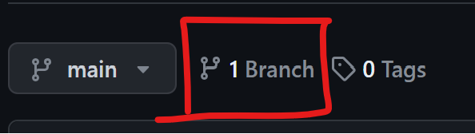

---

### Make a new branch.

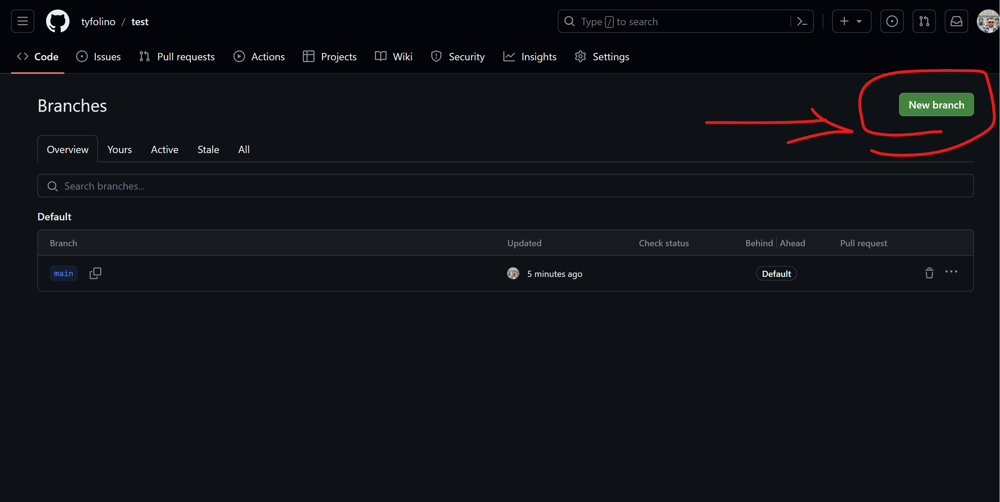

---

### Create branches for each group member including the owner!

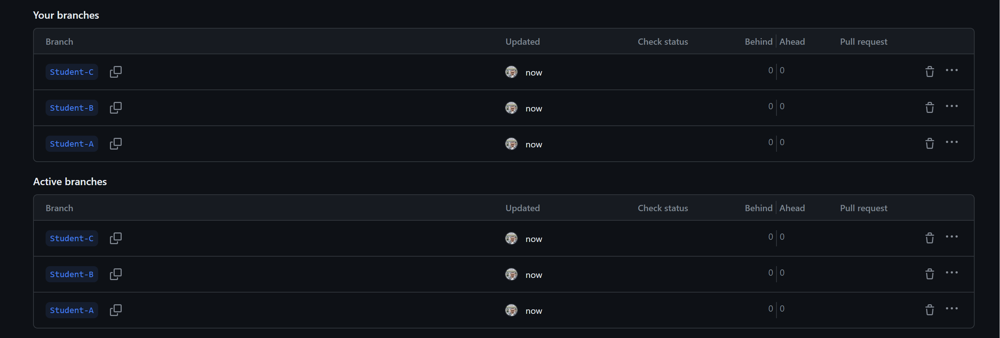

---

### Now, the other members can clone the repository.

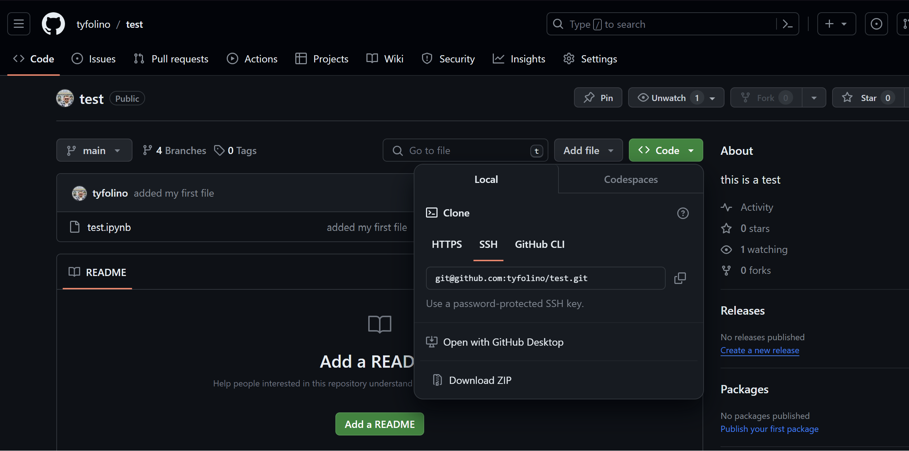

---

### Paste the git link into the `git clone` dialog box

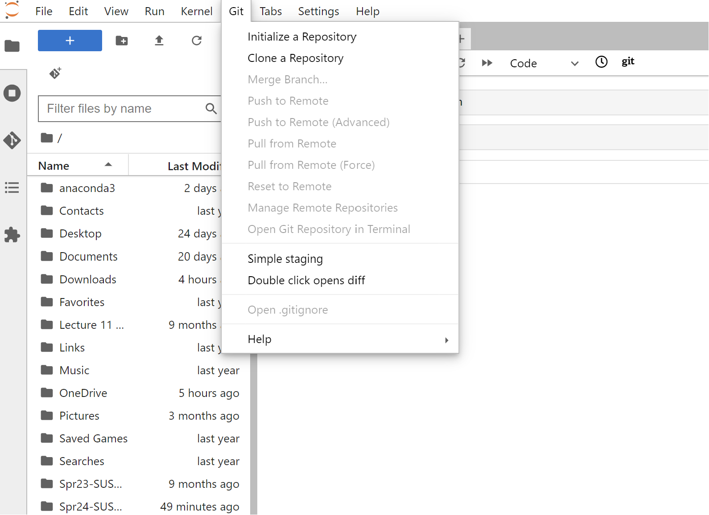

---

### When you work on this group project, make sure you are in *your* branch!

---

When you are ready to merge your changes into the `main` branch, make a pull request.

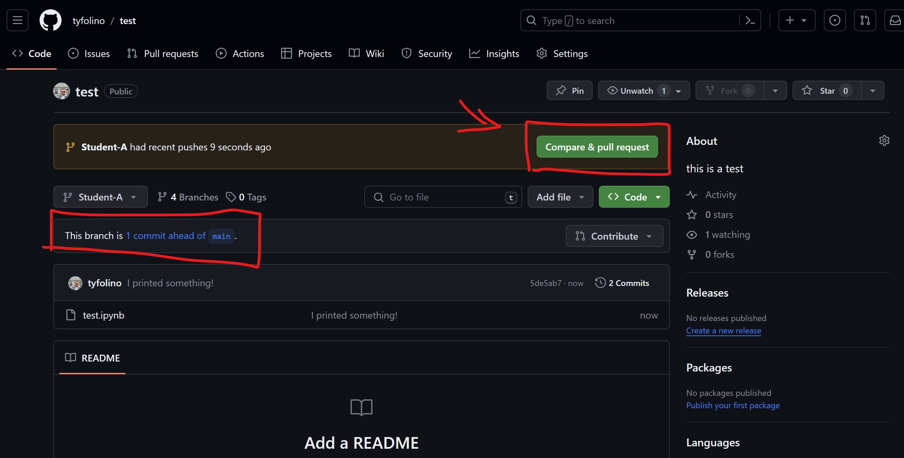

---

### Open a pull request

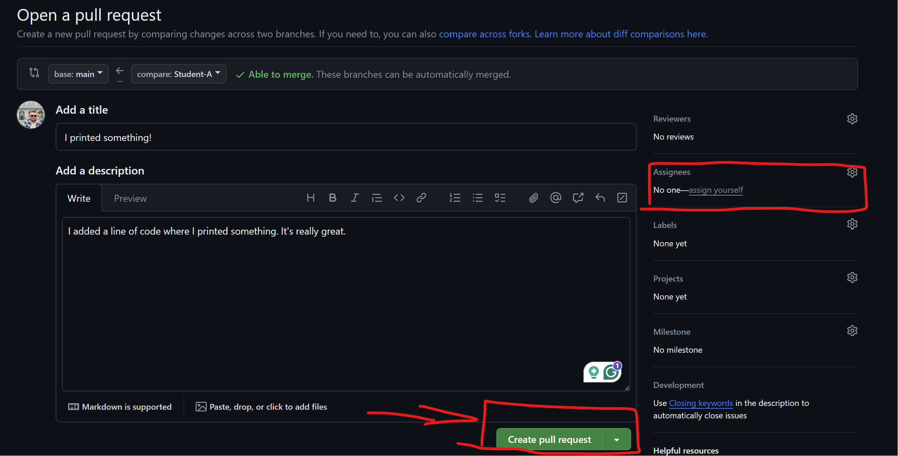

---

### Merge pull request

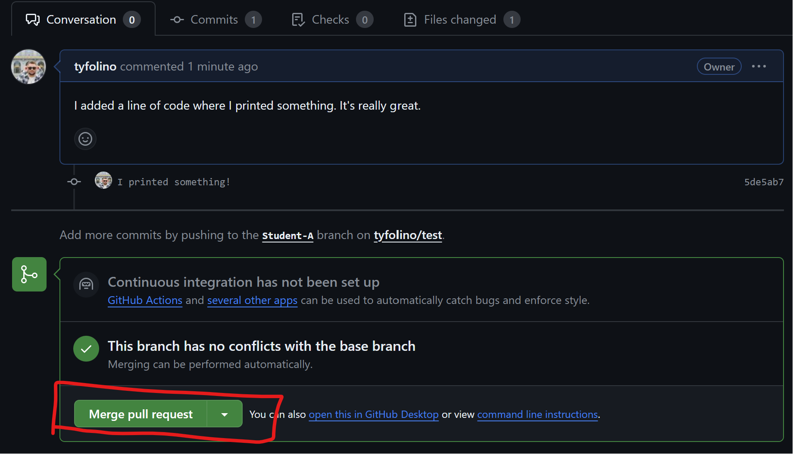

