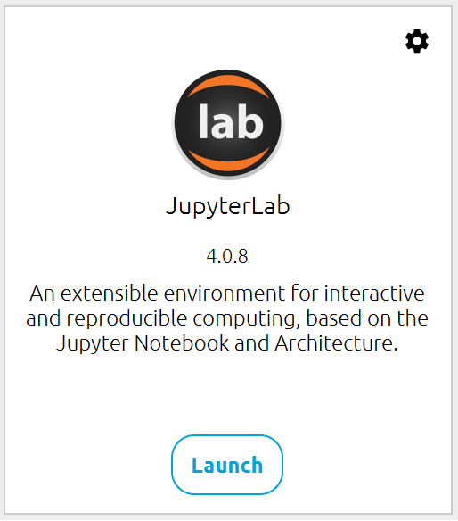

# Git, GitHub, and Jupyter Setup

Ty Janoski
City College of New York, CUNY 

---

# Step 1

---

We will need three packages, plus an optional one:
- JupyterLab
- JupyterLab-git
- git
- ipykernel

---

# Package installs

- Open up a terminal
    - **MacOS**: Spyder IPython console or Mac terminal
    - **Windows**: Anaconda Prompt or Windows terminal
- Make sure your `susc` environment is active!
`conda activate susc`

- Install other packages
    - `conda install -c defaults jupyterlab`
    - `conda install -c conda-forge jupyterlab-git git ipykernel`

---

# Make our `susc` environment a kernel*

In the same terminal you did your conda installs, run the following code:
`python -m ipykernel install --user --name=susc`
  

*: Don't worry about what this means yet.

---

# Let's make sure it works.
- On your Anaconda Navigator, after refreshing, check to see that have a JupyterLab tile.

---

# Help! I can't find JupyterLab!

Did you:
- install to the `susc` environment?
- look in the `susc` environment on Anaconda navigator?
- use `-c defaults` when installing JupyterLab?

If you checked all of these, you can try launching jupyter lab from your terminal by typing `jupyter lab`

---

# Step 2

---

### It's time for you to create a GitHub account if you don't already have one!

Follow the directions [here](https://docs.github.com/en/get-started/quickstart/creating-an-account-on-github).

  
Remember which email you use to sign up :)

---

# Step 3 for Windows Users

Windows users (myself included) can face some annoying hiccups using Anaconda + Jupyter + Git. I recommend [downloading Git](https://gitforwindows.org) to your Windows machine as a separate installation from Anaconda.

---

# Troubleshooting

---

# What to do if you can't get something to work:
- Google your problem!
    - I promise you are never the first to have a problem in 99.9% of programming cases (or life!)
- Check out source docs for [jupyterlab-git](https://github.com/jupyterlab/jupyterlab-git)
- Email me at <tyler.janoski@columbia.edu>
