# Git, GitHub, and Jupyter

Ty Janoski
City College of New York, CUNY 

---

## Let's set up a workflow for your in-class project.

---

### Creating a GitHub repository

Have *one* member of your group create a repository. This person will be the owner. * 
  
 * The owner doesn't have any special responsibilities, so don't worry. 

---

---

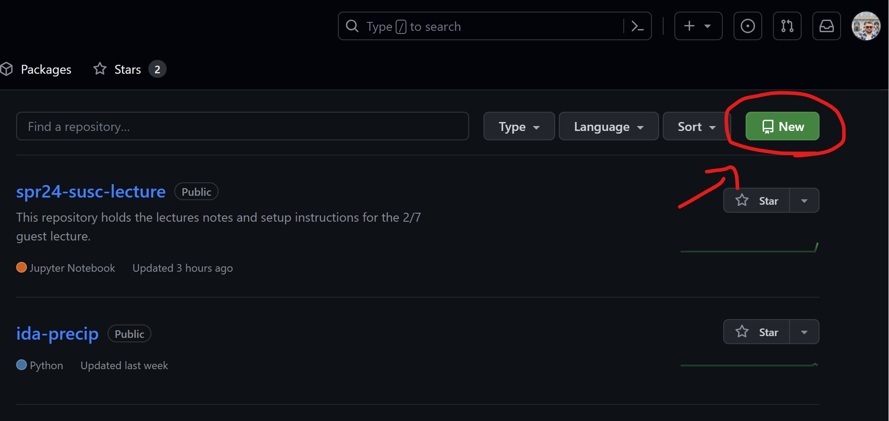

---

- Pick a name for your repository, like `SUSC`.
- Give it a short description.
- Leave it public.
- You can skip the `README`, `.gitignore`, and license for now.

--- 

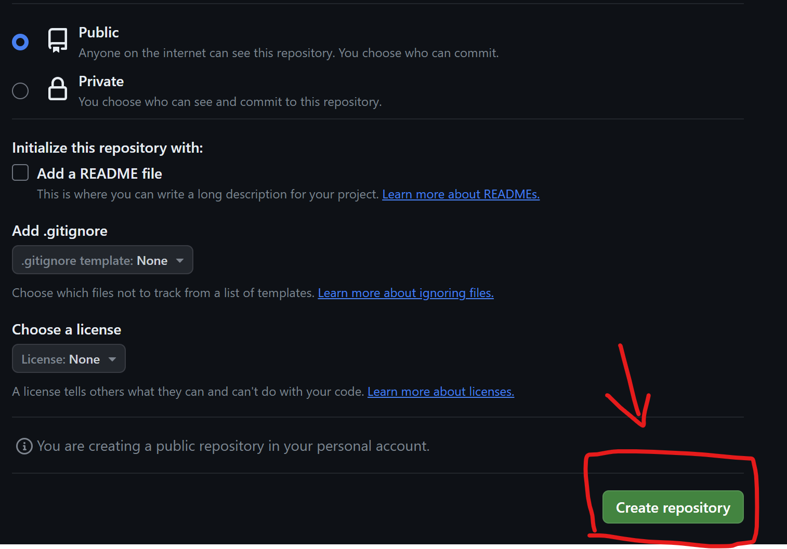

---

### Invite your group members as collaborators

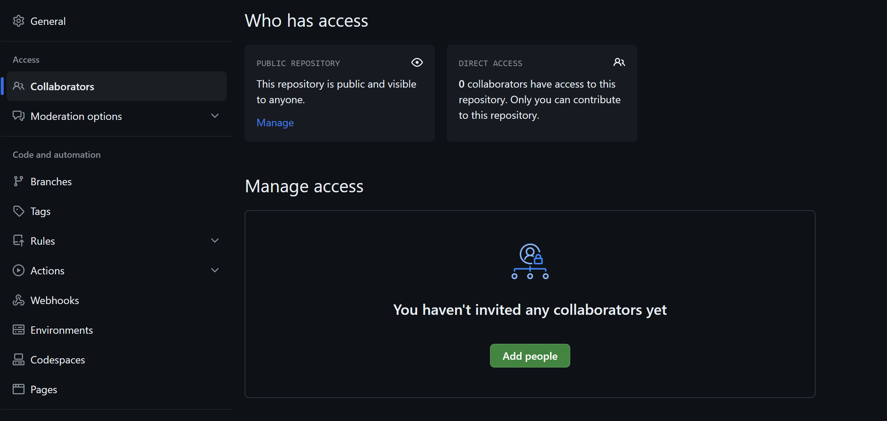

---

Create a new folder on your computer where your Jupyter Notebook for this class will live.

  

Make sure you can navigate to it using JupyterLab!

---

### Initialize a new repository

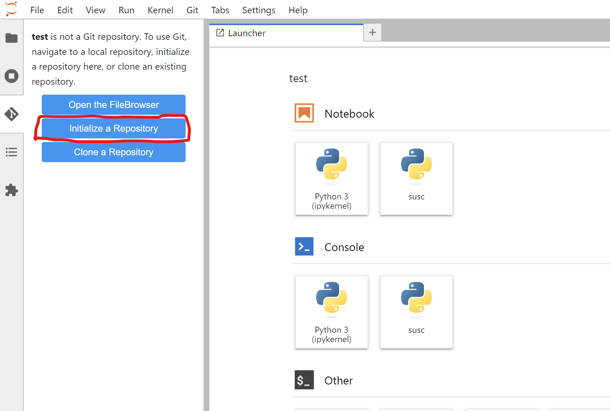

---

### Create a new notebook

- When selecting the kernel, make sure it is `susc`
- In your first cell, run this code:
`!git branch -m main`
- This just renames the branch from `master` to `main`

---

### Add your notebook

Hit the plus sign.

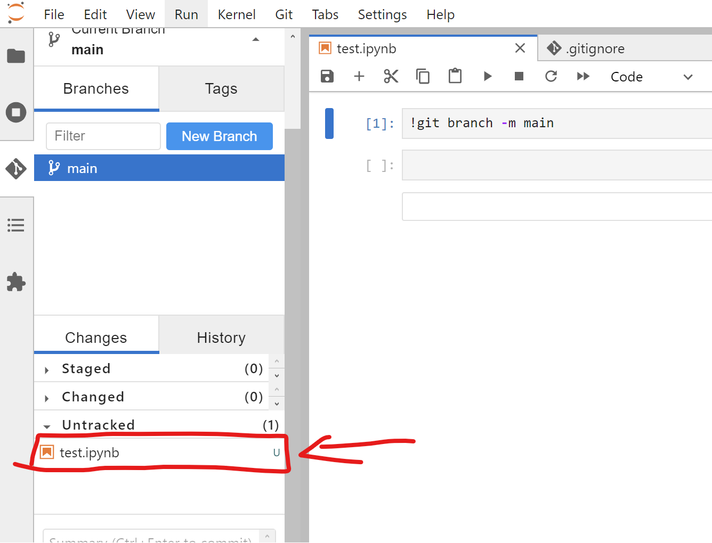

---

### Commit the changes
An example summary is "`added my first file`"

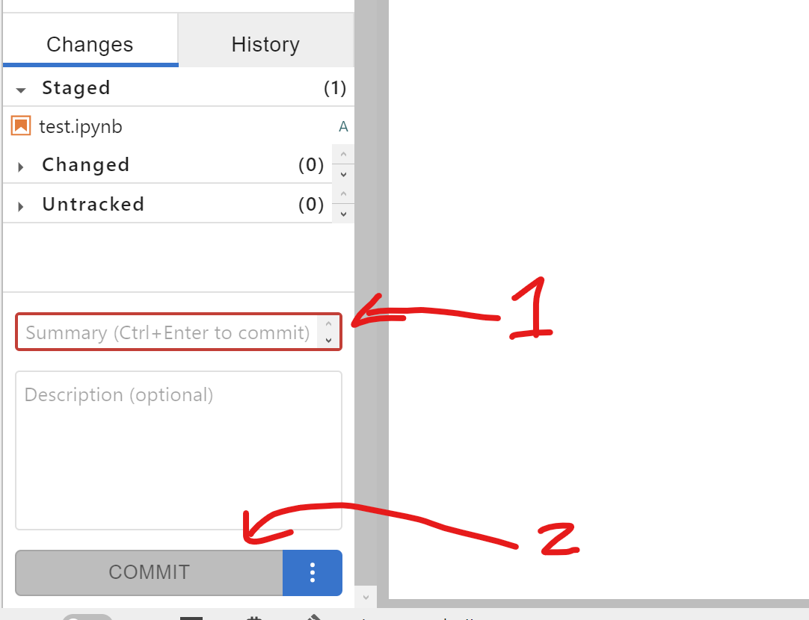

---

### Connect to remote repository

In the top menu bar, git -> manage remote

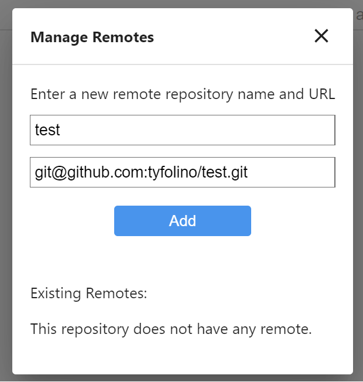

---

### Push to GitHub

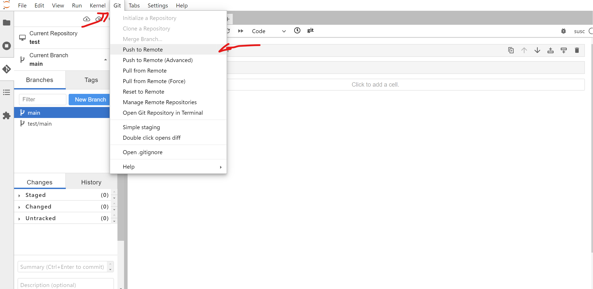

---

### If it worked, refresh your GitHub repository page and see your file there now!

---

### Now it's time for branches.

Create a new branch for each group member.

---

### Click on branches.

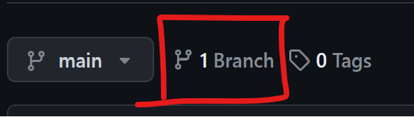

---

### Make a new branch.

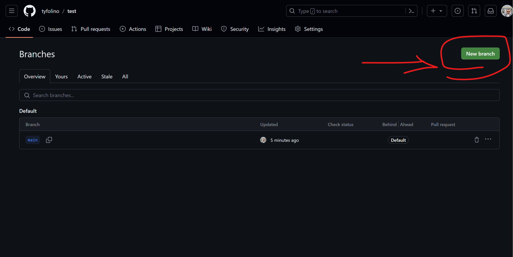

---

### Create branches for each group member including the owner!

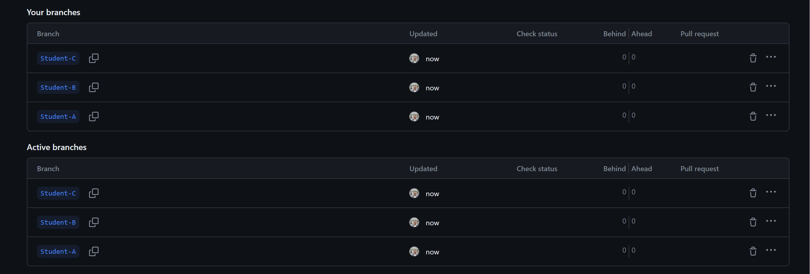

---

### Now, the other members can clone the repository.

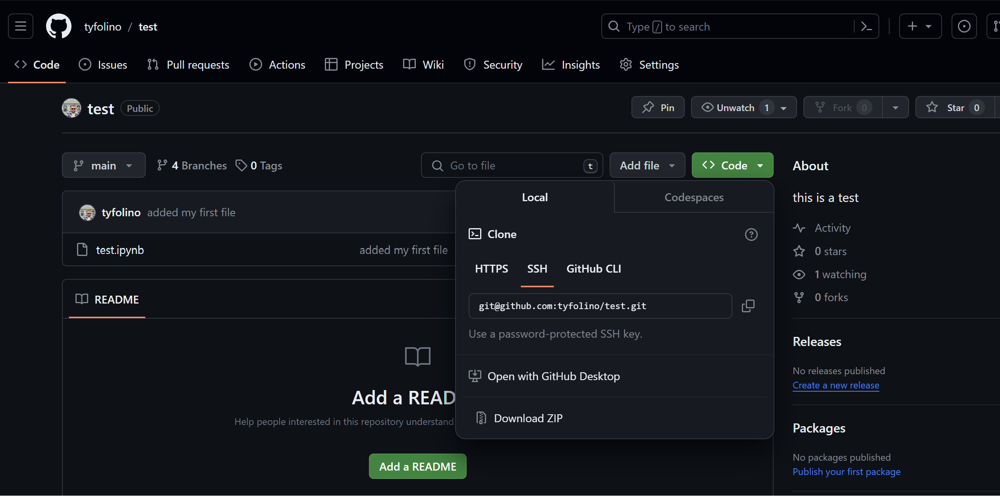

---

### Paste the git link into the `git clone` dialog box

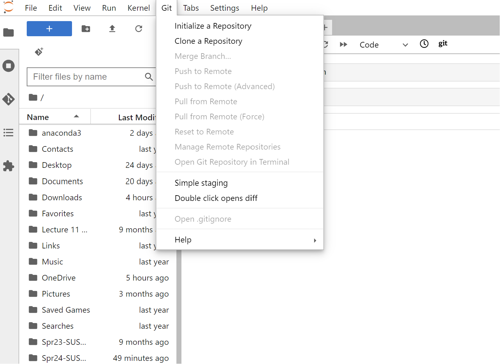

---

### When you work on this group project, make sure you are in *your* branch!

---

When you are ready to merge your changes into the `main` branch, make a pull request.

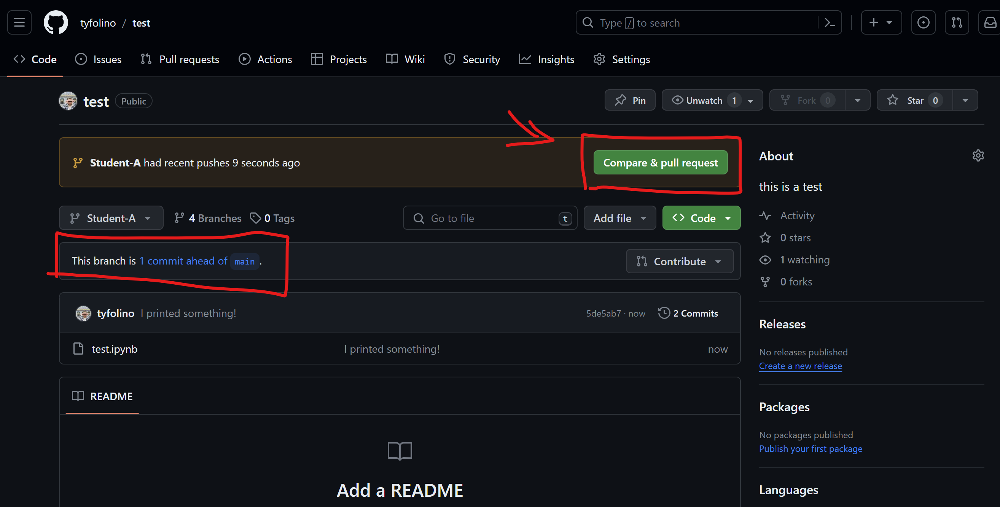

---

### Open a pull request

---

### Merge pull request

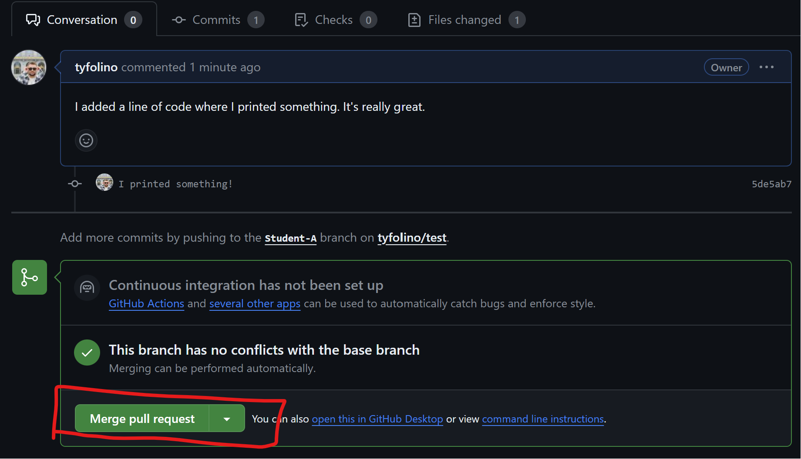

